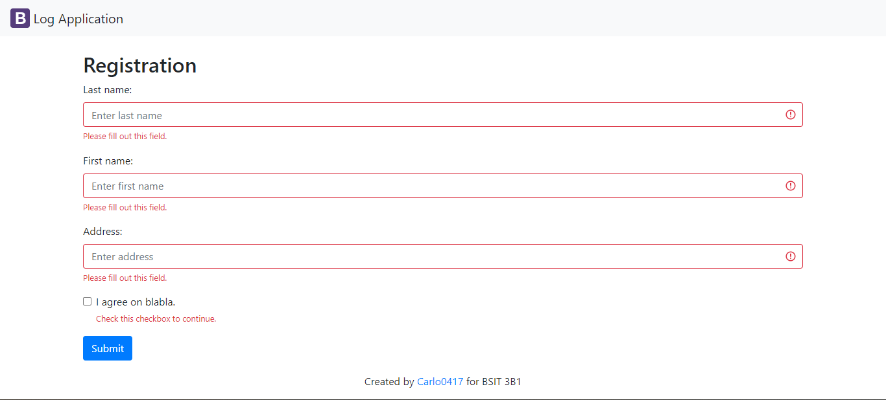
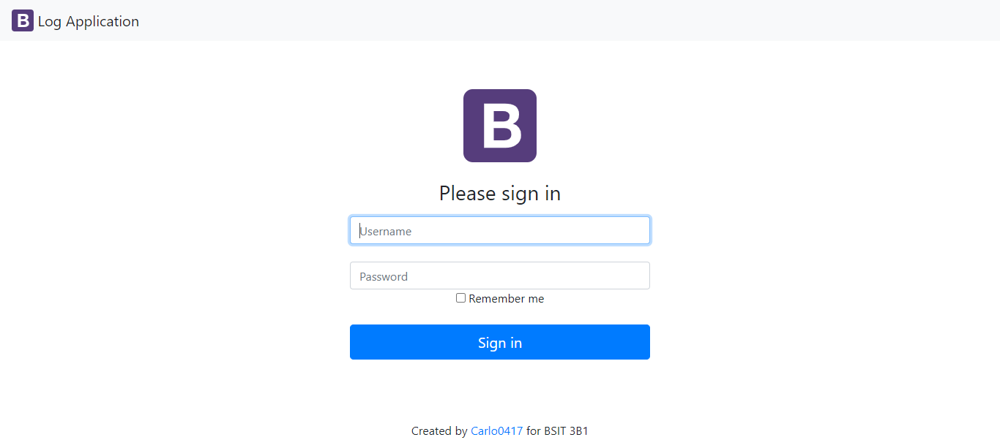
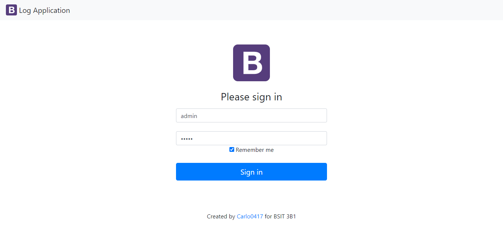
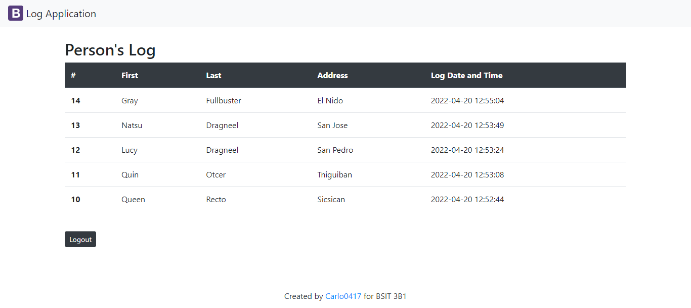

# **logApp-Recto**

via its Registration Page, logApp-Recto is an application that logs the individual's personal information as well as the date and time he or she visits the location. It also includes a Login Page that allows the administrator to access the Main Page and view the information obtained from the registration through table, as well as a Logout button that allows the administrator to quit the Main Page.

<br />

### **VISUALS**

### *Registration*
 <br />

### *Registration with data*
 <br />

### *Admin Login*
 <br />

### *Admin Login with credentials*
 <br />

### *Main Page contains table of data*
 <br /> <br />

# **Deploying Web Application in Heroku**
### **SETTING UP YOUR DATABASE IN A FREE WEB SERVER**
* Create an account at https://www.freesqldatabase.com
* Log in to your account, create a database and take note your database details.
* Click the "Follow this link for phpMy Admin".
* Setup your database:  
    1. Create tables - PERSON(pid, lastname, firstname, address, logdt) and USERACCOUNT(uid,username, password)  
    2. Make sure to set logDT data type to TIMESTAMP and default value to CURRENT_TIMESTAMP  
    3. Add atleast one (1) row in USERACCOUNT table so you can test the Log In page.  

<br />

### **EDITING LOGAPP SOURCE CODE**
* Open the file config.php, and modify the value set for DB_HOST, DB_USER, DB_PASS, DB_NAME
according to your Database details in freesqldatabase account.
* Test if the system functions as expected.
*  If yes, PUSH the content to logApp-YourLastname repository. Otherwise, fix that problem.

<br />

### **INSTALLING COMPOSER**
* Install Composer through this link https://getcomposer.org/download/ and follow the essential steps and codes provided.

<br />

### **INSTALLING HEROKU**
* Download Heroku
    * for 32 bit: https://cli-assets.heroku.com/heroku-x86.exe 
    * for 64 bit: https://cli-assets.heroku.com/heroku-x64.exe  
* Once installed, you can use the heroku command from your terminal. Try to login using heroku CLI, type the code below and press Enter.

```
$ heroku login
```

<br />

### **DEPLOYING THE LOGAPP**
* Create an app on Heroku, using create command.
```
$ heroku create
```
(Heroku generates a random name (in this case glacial-savannah-88734) for my app.)

* Deploy your code.
```
$ git push heroku main
```
* Ensure that at least one instance of the app is running.
```
$ heroku ps:scale web=1
```

* Now visit the app at the URL generated by its app name.
```
$  heroku open
```
<br />

### **APPLYING CHANGES**
* Every time you change something in your application. To update your website, just push the modified files
to the repository.
```
$ git add .
$ git commit -m "changes made"
$ git push heroku main
```
<br />

### **AUTHOR**

## **Queenie Recto**


